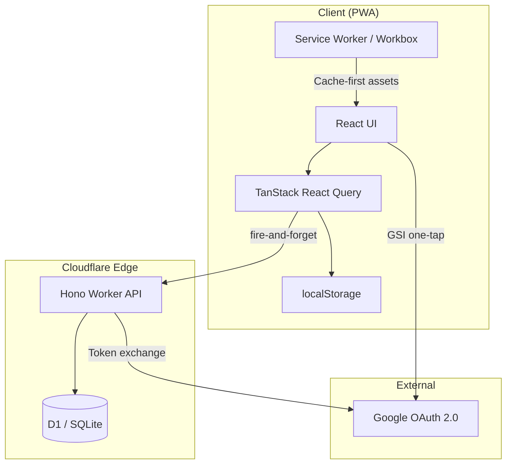
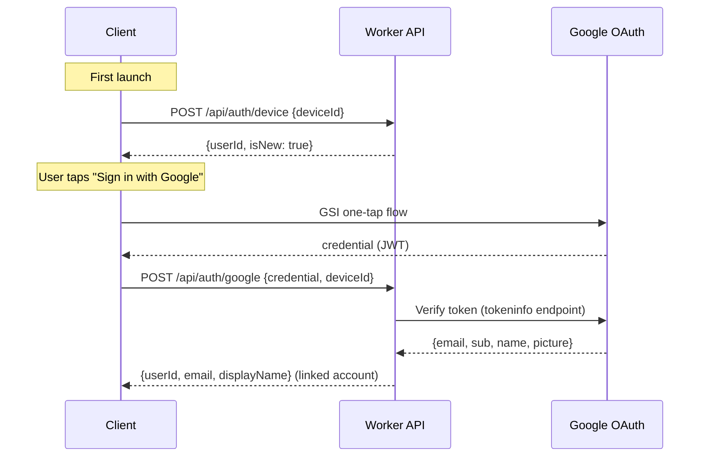
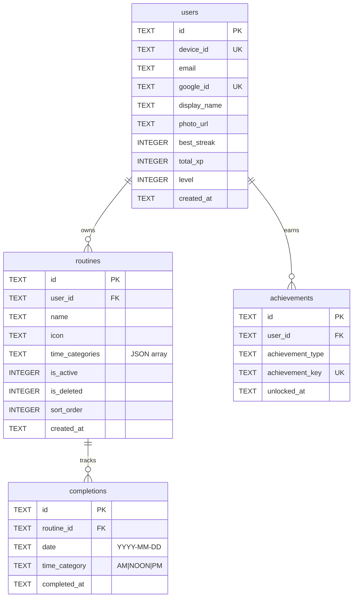
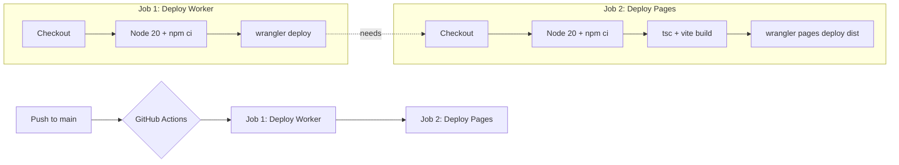

# Architecture & Design Guide

> Technical architecture, design system, and development guide for Routine Minder.

---

## Table of Contents

- [System Overview](#system-overview)
- [High-Level Architecture](#high-level-architecture)
- [Frontend Architecture](#frontend-architecture)
- [Backend Architecture](#backend-architecture)
- [Database Schema](#database-schema)
- [Data Flow & Sync Strategy](#data-flow--sync-strategy)
- [Design System & UX Guidelines](#design-system--ux-guidelines)
- [CI/CD & Deployment](#cicd--deployment)
- [Local Development](#local-development)
- [Testing](#testing)

---

## System Overview

Routine Minder is an **offline-first Progressive Web App** for daily habit tracking with gamification. The architecture follows a two-tier model:

| Layer | Technology | Host |
|-------|-----------|------|
| Frontend (PWA) | React 18 · TypeScript · Vite 7 | Cloudflare Pages |
| Backend (API) | Hono · Cloudflare Workers | Cloudflare Workers |
| Database | D1 (SQLite at the edge) | Cloudflare D1 |

The app is designed to work **entirely offline** using `localStorage`. The backend is optional and enables cross-device sync via Google Sign-In.

---

## High-Level Architecture



**Key principle**: The PWA reads/writes to `localStorage` first (instant UI), then syncs to the Worker API in the background. The backend is never in the critical path for reads.

---

## Frontend Architecture

### Tech Stack

| Concern | Library |
|---------|---------|
| Framework | React 18 |
| Language | TypeScript (strict) |
| Bundler | Vite 7 |
| Routing | Wouter (micro-router) |
| Server State | TanStack React Query (`staleTime: 60s`, `retry: 1`) |
| Forms | react-hook-form + Zod validation |
| UI Components | shadcn/ui (New York style) + Radix primitives |
| Styling | Tailwind CSS + tailwindcss-animate |
| Motion | Framer Motion |
| Icons | Lucide React + React Icons |
| Charts | Recharts |
| Dates | date-fns |
| PWA | vite-plugin-pwa (Workbox, autoUpdate strategy) |

### Directory Layout

```
client/
├── index.html              # SPA entry point
├── public/icons/            # PWA icons & logo
└── src/
    ├── main.tsx             # React root, QueryClientProvider, ThemeProvider
    ├── App.tsx              # Wouter routes + bottom nav shell
    ├── index.css            # Tailwind + CSS variables + glass utilities
    ├── components/
    │   ├── ui/              # shadcn/ui primitives (button, card, dialog…)
    │   ├── bottom-nav.tsx   # 4-tab mobile nav (Today, Routines, Dashboard, Settings)
    │   ├── routine-checkbox.tsx
    │   ├── activity-heatmap.tsx
    │   ├── achievements-modal.tsx
    │   ├── progress-bar.tsx
    │   ├── date-navigator.tsx
    │   ├── emoji-picker.tsx
    │   ├── theme-provider.tsx
    │   ├── landing-page.tsx
    │   └── error-boundary.tsx
    ├── pages/
    │   ├── today.tsx        # Daily checklist (default route)
    │   ├── routines.tsx     # CRUD management
    │   ├── dashboard.tsx    # Bento-grid analytics
    │   ├── settings.tsx     # Theme, sync, export, account
    │   ├── about.tsx
    │   ├── privacy.tsx
    │   └── terms.tsx
    ├── lib/
    │   ├── storage.ts       # Offline-first data layer + API client
    │   ├── stats.ts         # Gamification engine (pure functions)
    │   ├── achievements.ts  # XP, levels, achievements definitions
    │   ├── schema.ts        # Zod schemas (Routine, Completion, Settings…)
    │   ├── queryClient.ts   # TanStack Query config
    │   ├── notifications.ts # Web Push stub
    │   ├── export.ts        # CSV/JSON export/import
    │   └── utils.ts         # cn() helper (clsx + tailwind-merge)
    ├── hooks/
    │   ├── use-mobile.tsx   # Responsive breakpoint hook
    │   └── use-toast.ts     # Toast notification hook
    └── test/
        └── setup.ts         # Vitest + jsdom + @testing-library setup
```

### Routing

| Path | Page | Description |
|------|------|-------------|
| `/` | Today | Daily checklist with date navigation |
| `/routines` | Routines | Create, edit, reorder, delete routines |
| `/dashboard` | Dashboard | Bento-grid analytics, heatmap, achievements |
| `/settings` | Settings | Theme, sync, export/import, account |
| `/about` | About | App info |
| `/privacy` | Privacy | Privacy policy |
| `/terms` | Terms | Terms of service |

Navigation uses a persistent **4-tab bottom nav** (`Today · Routines · Dashboard · Settings`) rendered as a fixed footer on mobile.

### State Management

```
┌──────────────────────────────────────────────┐
│                  React Query                  │
│  ┌──────────┐  ┌──────────┐  ┌────────────┐ │
│  │ routines │  │completions│  │  dashboard │ │
│  └────┬─────┘  └────┬─────┘  └─────┬──────┘ │
│       │              │              │         │
│       ▼              ▼              ▼         │
│  ┌──────────────────────────────────────────┐│
│  │         storage.ts (data layer)          ││
│  │  ┌──────────┐    ┌───────────────────┐   ││
│  │  │localStorage│◄──│ fire-and-forget   │   ││
│  │  │  (primary) │   │  API sync         │   ││
│  │  └──────────┘    └───────────────────┘   ││
│  └──────────────────────────────────────────┘│
└──────────────────────────────────────────────┘
```

- **Reads**: Always from `localStorage` (instant).
- **Writes**: `localStorage` first → background `fetch()` to Worker API.
- **Background sync**: 5-minute polling interval when signed in.
- **Stale time**: 60 seconds — React Query won't refetch within this window.

### Offline-First Strategy

| Operation | Offline Behavior |
|-----------|-----------------|
| View today / dashboard | ✅ Fully functional from localStorage |
| Toggle completion | ✅ Stored locally, synced later |
| Create / Edit / Delete routine | ❌ Requires network (API-gated) |
| Export data | ✅ Reads from localStorage |

The Service Worker (Workbox) intercepts network requests and serves cached assets. Google Fonts are cached with a **CacheFirst** strategy.

---

## Backend Architecture

### Worker API

Single-file Hono application ([worker/src/index.ts](worker/src/index.ts)) deployed as a Cloudflare Worker.

**Middleware stack**:
1. **CORS** — Allows `localhost:5173`, production domain, and `*.pages.dev`
2. **API Key** — `X-API-Key` header validated against `API_SECRET` env var (skipped for health check)

### API Endpoints

| Method | Path | Description |
|--------|------|-------------|
| `GET` | `/` | Health check |
| `POST` | `/api/auth/device` | Get or create anonymous device user |
| `POST` | `/api/auth/google` | Google OAuth token exchange + account linking |
| `GET` | `/api/user/stats` | Fetch user gamification stats |
| `PUT` | `/api/user/stats` | Update user gamification stats |
| `GET` | `/api/routines` | List active routines for user |
| `POST` | `/api/routines` | Create routine |
| `PUT` | `/api/routines/:id` | Update routine |
| `DELETE` | `/api/routines/:id` | Soft-delete routine |
| `GET` | `/api/completions` | List completions (supports `?from=&to=` date range) |
| `POST` | `/api/completions/toggle` | Toggle completion for a routine/date/timeCategory |
| `GET` | `/api/dashboard` | Aggregated dashboard data |
| `POST` | `/api/sync` | Full bidirectional sync (routines + completions) |
| `DELETE` | `/api/users/:userId` | GDPR account deletion (cascades all data) |

All `/api/*` endpoints require `X-API-Key` header and `X-User-ID` header for user identification.

### Authentication Flow



---

## Database Schema

**Engine**: Cloudflare D1 (SQLite at the edge)



### Migrations

Migrations live in `worker/migrations/` and are applied with Wrangler:

| File | Purpose |
|------|---------|
| `001_init.sql` | Core tables: users, routines, completions |
| `002_icon_and_google.sql` | Add `icon` to routines, `google_id` to users |
| `003_google_auth.sql` | Unique index on `google_id`, add `display_name`, `photo_url` |
| `004_soft_delete_and_gamification.sql` | `is_deleted` flag, XP/level/best_streak fields, achievements table |
| `005_unique_routine_name.sql` | Unique constraint on (user_id, name) for active routines |

---

## Data Flow & Sync Strategy

### Completion Toggle (Happy Path)

```
User taps checkbox
        │
        ▼
  storage.toggleCompletion()
        │
        ├──► localStorage.setItem()     ← instant UI update
        │
        └──► fetch("/api/completions/toggle")  ← fire-and-forget
                    │
                    ▼
              Worker upserts/deletes in D1
```

### Full Sync Flow

When signed in, a background sync runs every **5 minutes**:

1. Client sends all local routines + completions to `POST /api/sync`
2. Worker merges by timestamp (latest wins)
3. Worker returns canonical state
4. Client replaces localStorage with server response

---

## Design System & UX Guidelines

### Color System

The app uses **HSL CSS custom properties** defined in [client/src/index.css](client/src/index.css). All shadcn/ui components reference these tokens, providing automatic light/dark mode support.

| Token | Light | Dark | Usage |
|-------|-------|------|-------|
| `--primary` | `hsl(24 95% 53%)` — Warm Coral | `hsl(24 95% 60%)` | Buttons, links, focus rings |
| `--accent` | `hsl(173 80% 40%)` — Teal | `hsl(173 70% 42%)` | Success states, streaks, energy |
| `--background` | `hsl(0 0% 100%)` — White | `hsl(222 47% 11%)` — Dark Slate | Page background |
| `--card` | `hsl(0 0% 100%)` | `hsl(222 47% 14%)` | Card surfaces |
| `--muted-foreground` | `hsl(215 16% 47%)` | `hsl(215 20% 65%)` | Secondary text |
| `--destructive` | `hsl(0 84% 60%)` | `hsl(0 63% 31%)` | Delete, errors |
| `--chart-1…5` | Coral, Teal, Gold, Purple, Blue | Adjusted for dark visibility | Recharts palette |

**Theme switching**: Managed by `next-themes` with `class` strategy on `<html>`. Toggle lives in Settings page.

### Glassmorphism

The signature visual style. Two utility classes are provided:

```css
/* Full glass effect — hero elements, modals */
.glass {
  @apply bg-white/70 dark:bg-black/40 backdrop-blur-md
         border border-white/20 dark:border-white/10 shadow-lg;
}

/* Subtle glass — cards, list items */
.glass-card {
  @apply bg-card/80 backdrop-blur-sm border border-border/50
         shadow-sm transition-all hover:shadow-md;
}
```

**When to use**:
- `.glass-card` — Default for all card surfaces (today's routines, dashboard tiles, settings sections)
- `.glass` — Elevated overlays, hero sections, modals

### Typography

- **Font family**: System sans-serif stack (configured via Tailwind `font-sans`)
- **Scale**: Tailwind default (`text-sm` for body, `text-lg`/`text-xl` for headings within cards, `text-2xl`/`text-3xl` for page titles)
- **Weight**: `font-medium` for labels, `font-semibold` for card titles, `font-bold` for hero numbers

### Layout Patterns

| Pattern | Implementation |
|---------|---------------|
| **Mobile-first max-width** | All pages wrapped in `max-w-lg mx-auto` (constrains to phone width on desktop) |
| **Bottom navigation** | Fixed footer with 4 tabs — icon + label, active state uses `--primary` |
| **Bento grid** | Dashboard uses CSS grid (`grid-cols-2` on mobile, varying spans) |
| **Pull-to-refresh feel** | Swipe-style date navigator on Today page |
| **Safe area padding** | Bottom padding accounts for nav bar + iOS safe area |

### Animation Guidelines

Using Framer Motion (`motion` components):

| Element | Animation | Duration |
|---------|-----------|----------|
| Page transitions | Fade + slight upward slide | 200-300ms |
| Card entry | `initial={{ opacity: 0, y: 20 }}` staggered | 100ms stagger |
| Checkbox toggle | Scale bounce + confetti-style particle | 300ms |
| Achievement unlock | Scale pop + glow effect | 400ms |
| Heatmap cells | Fade in with stagger by week | 50ms per cell |

**Principles**:
- Animations should feel **snappy** — never exceed 400ms
- Use `layout` prop for elements that change size/position
- Reduce motion: respect `prefers-reduced-motion` (Framer Motion handles this)

### Component Conventions

- **shadcn/ui style**: New York variant with `neutral` base color
- **Icon size**: Default `h-4 w-4` inline, `h-5 w-5` in nav, `h-8 w-8` for hero/empty states
- **Spacing**: `p-4` card padding, `gap-3` between list items, `space-y-4` between sections
- **Border radius**: `--radius: 0.75rem` (shadcn default, applied via `rounded-lg`)
- **Empty states**: Centered icon + message + action button, use muted foreground color
- **Loading states**: Skeleton components from shadcn/ui, same dimensions as loaded content

### Accessibility

- All interactive elements use Radix primitives (keyboard navigation, focus management, ARIA built-in)
- Color contrast meets WCAG AA on both light and dark themes
- Touch targets: minimum 44×44px for mobile tap areas
- Screen reader: Meaningful labels on icon-only buttons via `aria-label`

---

## CI/CD & Deployment

### Pipeline Overview

Deployments are automated via GitHub Actions (`.github/workflows/deploy.yml`).



**Trigger conditions**:
- Push to `main` branch
- Pull request targeting `main` (for deploy previews)
- Manual dispatch (`workflow_dispatch`)

**Job dependency**: `deploy-pages` runs only after `deploy-worker` succeeds. This ensures the API is updated before the frontend talks to it.

### Required GitHub Secrets

| Secret | Purpose |
|--------|---------|
| `CLOUDFLARE_API_TOKEN` | Wrangler authentication (Workers Scripts:Edit, Pages:Edit permissions) |
| `CLOUDFLARE_ACCOUNT_ID` | Cloudflare account identifier |
| `VITE_API_URL` | Worker API URL (e.g., `https://routine-minder-api.xxx.workers.dev`) |
| `VITE_API_KEY` | Shared API key for `X-API-Key` header |
| `VITE_GOOGLE_CLIENT_ID` | Google OAuth Client ID |
| `VITE_VAPID_PUBLIC_KEY` | (Optional) Web Push VAPID key |

### Infrastructure

| Service | Resource | Config |
|---------|----------|--------|
| Cloudflare Pages | `routine-minder` project | Auto-deploy from `dist/` |
| Cloudflare Workers | `routine-minder-api` | Configured in `worker/wrangler.toml` |
| Cloudflare D1 | `routine-minder-db` | Binding in worker wrangler.toml |
| Custom Domain | `routine-minder.ravishankars.com` | DNS via Cloudflare |

---

## Local Development

### Prerequisites

- **Node.js** 20+ (matches CI)
- **npm** 9+
- **Wrangler CLI** (`npm install -g wrangler` or use `npx`)

### Frontend

```bash
# Install dependencies
npm install

# Start Vite dev server (http://localhost:5173)
npm run dev

# Type-check without emitting
npm run check
```

The dev server supports HMR. Environment variables (`VITE_*`) must be placed in the **`client/`** directory (where Vite's `root` is configured), not the project root:

```bash
# Create client/.env.local for local overrides (gitignored)
cat > client/.env.local << 'EOF'
VITE_API_URL=http://localhost:8787
VITE_API_KEY=
EOF
```

> **Gotcha**: The `.env` file at the project root is _not_ read by Vite during `npm run dev`. Vite resolves env files relative to its `root` setting (`client/`). The root `.env` is only a reference — actual local overrides go in `client/.env.local`.

### Worker (Backend)

```bash
cd worker

# Install worker dependencies
npm install

# Apply migrations to local D1 (creates .wrangler/state/ SQLite file)
npx wrangler d1 migrations apply routine-minder-db --local

# Start local Worker dev server (http://localhost:8787)
npx wrangler dev --port 8787
```

> **Gotcha**: If you run `wrangler dev` from the `worker/` directory and it errors with _"Workers-specific command in a Pages project"_, Wrangler is walking up and finding the root `wrangler.toml` (which is a Pages config). Fix by using the explicit config flag:
> ```bash
> npx wrangler dev --config worker/wrangler.toml --port 8787
> ```

The local Worker uses an in-process SQLite database (no Cloudflare account needed for local dev). `API_SECRET` is not set locally, so the API key middleware is skipped during development.

### Full Stack Local

Run both in separate terminals:

```bash
# Terminal 1: Frontend
npm run dev

# Terminal 2: Backend (from project root)
npx wrangler dev --config worker/wrangler.toml --port 8787
```

With `VITE_API_URL=http://localhost:8787` in `client/.env.local`, the frontend will talk to the local Worker.

> **First-time setup**: On first load the app creates a `local_*` user ID when the API is unreachable. If you start the Worker _after_ the frontend, clear localStorage (`Settings → Clear Local Data`) so the device re-registers with D1. Otherwise routine creation will fail with a foreign key error.

### Deploying Changes Manually

```bash
# Deploy Worker
cd worker && npx wrangler deploy

# Apply migrations to production D1
npx wrangler d1 migrations apply routine-minder-db --remote

# Build and deploy frontend
cd .. && npm run build
npx wrangler pages deploy dist --project-name=routine-minder
```

---

## Testing

### Stack

| Tool | Layer | Purpose |
|------|-------|---------|
| Vitest | Unit | Test runner (Vite-native, fast) |
| jsdom | Unit | Browser environment simulation |
| @testing-library/react | Unit | Component testing utilities |
| @testing-library/jest-dom | Unit | DOM assertion matchers |
| Playwright | E2E | Full browser integration tests |

### Running Tests

```bash
# Unit tests (watch mode)
npm run test

# Unit tests (single run, CI mode)
npx vitest run

# E2E tests (requires local Worker + Frontend running)
npm run test:e2e

# E2E with visible browser
npm run test:e2e:headed
```

### Unit Test Configuration

Configured in `vitest.config.ts`:
- **Environment**: `jsdom`
- **Setup file**: `client/src/test/setup.ts` (imports `@testing-library/jest-dom`)
- **Path alias**: `@` → `client/src/`

Current unit tests focus on the gamification engine:
- `client/src/lib/achievements.test.ts` — XP calculations, level thresholds, achievement unlocking

### E2E Test Configuration

Configured in `playwright.config.ts`:
- **Browser**: Chromium (headless by default)
- **Viewport**: 390 × 844 (iPhone 14)
- **Base URL**: `http://localhost:5173`
- **Test dir**: `e2e/`
- **Timeout**: 30 s per test, 10 s per action

#### Prerequisites

Install worker dependencies and Playwright browsers once:

```bash
cd worker && npm install && cd ..
npx playwright install --with-deps chromium
```

Playwright's `webServer` config (in `playwright.config.ts`) auto-starts both the Worker and Vite dev server.  
If you already have them running, Playwright reuses them (skipped in CI).

```bash
npm run test:e2e            # headless (CI-friendly)
npm run test:e2e:headed     # visible browser (debug / demo)
```

#### CI Integration

The `.github/workflows/playwright.yml` workflow runs E2E tests on every push/PR to `main`.  
Screenshots are captured for every test and the HTML report + screenshots are uploaded as artifacts (retained 30 days).

#### Test Suite (`e2e/app.spec.ts`)

| Group | Tests | What it covers |
|-------|------:|----------------|
| Today Page | 2 | Empty state message, bottom nav tabs |
| Routine Management | 2 | Create single routine, create multiple routines |
| Completion Flow | 1 | Toggle routine checkbox, progress counter updates |
| Dashboard | 2 | Empty "No Data Yet" state, stats after completions |
| Settings | 3 | All sections visible, Google sign-in button, footer links |
| Navigation | 1 | Navigate through all four main pages |

Each test starts with a clean `localStorage` (stale user data removed) while preserving the `rm_visited` flag so the landing page is skipped. The `beforeEach` waits for device-auth against the local Worker before any assertions run.

### Testing Guidelines

- **Pure logic first**: Prioritize testing pure functions in `lib/` (stats, achievements, schema validation)
- **Component tests**: Use `@testing-library/react` with `render()` + user events
- **E2E tests**: Full-stack smoke tests against local Worker + Vite dev server
- **No mocking localStorage**: Tests can use real localStorage (jsdom provides it)
- **Naming**: `describe("functionName")` → `it("should behavior when condition")`

---

## Gamification Engine

Quick reference for the XP and progression system (implemented in `client/src/lib/stats.ts` and `client/src/lib/achievements.ts`):

| Concept | Value |
|---------|-------|
| Base XP per completion | 10 |
| 7-day streak multiplier | 1.25× |
| 14-day streak multiplier | 1.5× |
| 30-day streak multiplier | 2× |
| Level thresholds | 0 → 100 → 500 → 1500 → 5000 → 15000 |
| Level names | Novice → Apprentice → Practitioner → Expert → Master → Legend |
| Total achievements | 26 across streak, completion, time-category, and misc categories |

---

*Last updated: v2.2*
